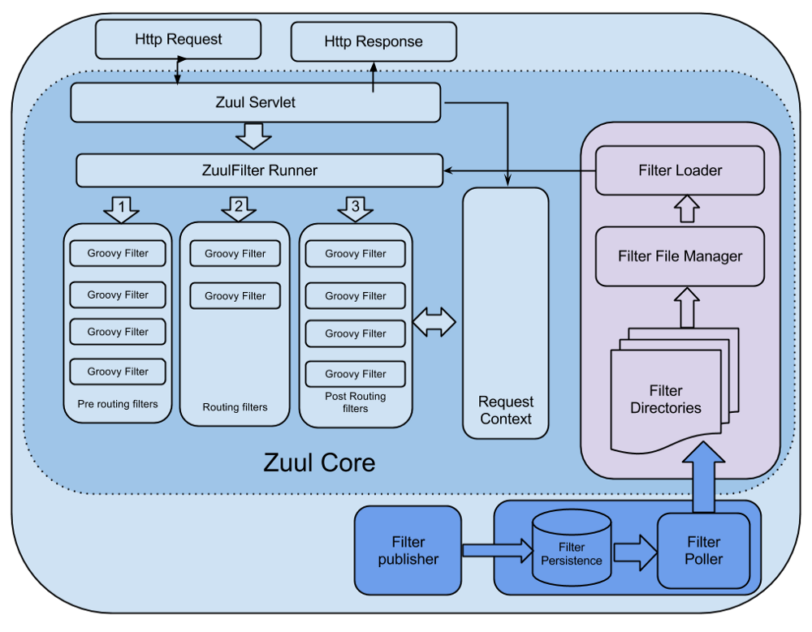
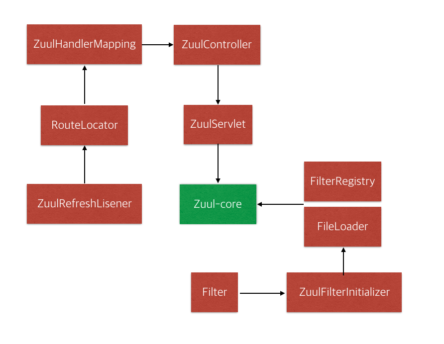
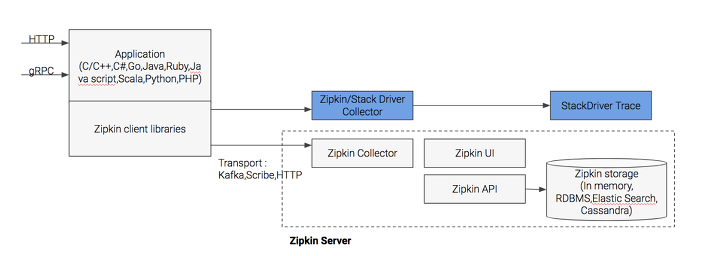
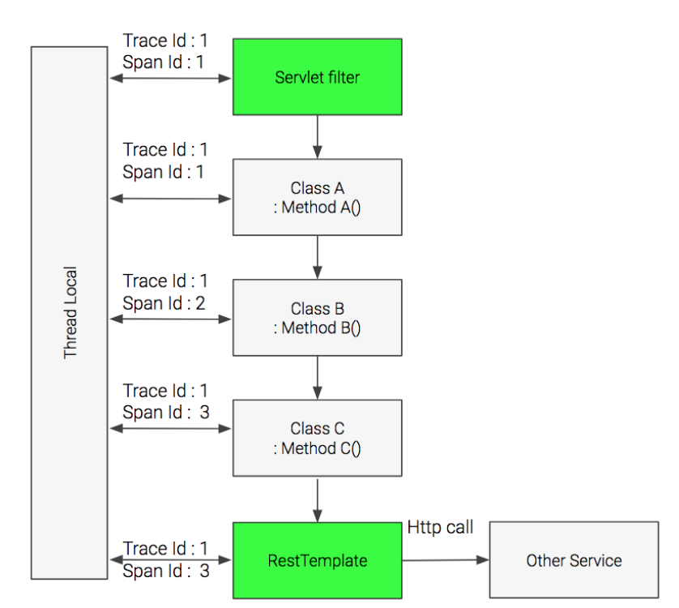
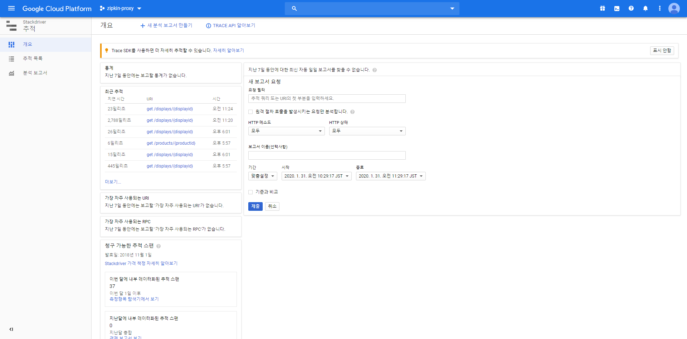
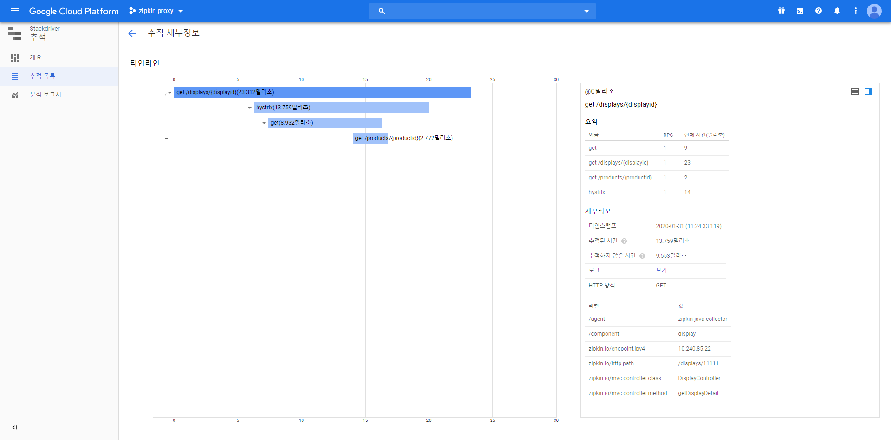
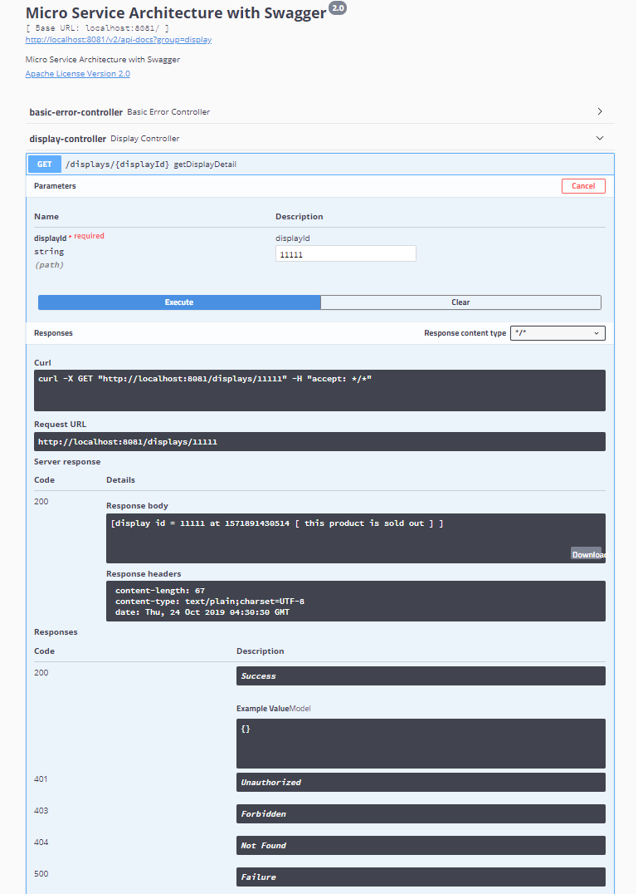

# SpringBoot-MSA-Workshop
[](https://gitter.im/MSA_miniProject/community)&nbsp;
[](https://spring.io/guides/gs/rest-service/)&nbsp;
&nbsp;

MSA Development Project with Spring Boot using Netflix OSS

# ■ Hystrix Dashboard
- Hystrix Dashboard는 앞의 Hystrix 설정에 따른 Circuit breaker의 상태를 모니터링 할 수 있는 dashboard를 제공해주는 라이브러리이다. 사실 라이브러리라기 보다는 솔루션에 가깝다고 할 정도로 간단한 설정으로 실행할 수 있다.
- Client 요청은 많은 traffic과 다양한 형태(예상하지 못한 형태)의 요청으로 경고없이 운영 이슈 발생 상황에 신속히 대응할 수 있는 시스템 zuul을 개발
- zuul은 이런한 문제를 신속하고, 동적으로 해결하기 위해서 groovy 언어로 작성된 다양한 형태의 Filter를 실행한다.
- Filter에 기능을 정의하고, 이슈사항에 발생시 적절한 filter을 추가함으로써 이슈사항을 대비할 수 있다.

### Netflix Filter 기능

- Authentication and Security : 클라이언트 요청시, 각 리소스에 대한 인증 요구 사항을 식별하고 이를 만족시키지 않는 요청은 거부
- Insights and Monitoring : 의미있는 데이터 및 통계 제공
- Dynamic Routing : 필요에 따라 요청을 다른 클러스터로 동적으로 라우팅
- Stress Testing : 성능 측정을 위해 점차적으로 클러스터 트래픽을 증가
- Load Shedding : 각 유형의 요청에 대해 용량을 할당하고, 초과하는 요청은 제한
- Static Response handling : 클러스터에서 오는 응답을 대신하여 API GATEWAY에서 응답 처리

[Zuul Core Architecture]


### Spring Cloud Zuul

- Zuul-Core의 ZuulServlet을 그대로 사용하여, 아래 그림과 같이 Spring MVC 위에서 동작하기 위해 몇 가지를 추가

[Zuul Core]


[Spring Cloud Zuul]  [](http://cloud.spring.io/spring-cloud-netflix/spring-cloud-netflix.html)

- `RouteLocator`은 url path에 대한 routing을 지정한다. 요청이 들어오면 url path로 어떻게 routing 할 것인가를 정의하고 있다.
- `ZuulHandlerMapping`은 org.springframework.web.servlet.handler.AbstractUrlHandlerMapping을 상속받고, RouteLocator에 정의된 url path에 zuulController를 매핑한다. RouteLocator에 정의된 path의 요청이 들어오면 zuulController를 호출하게 된다.
- `ZuulController`은 org.springframework.web.servlet.mvc.ServletWrappingController를 상속받으며, ZuulServlet을 주입시킨다. 그래서 ZuulController로 들어온 모든 요청은 ZuulServlet으로 처리한다.
- `ZuulFilterInitializer`는 filter Map에 정의된 filter를 FilterRegistry에 등록하고, FilterLoader로 로딩한다.


### Zuul의 build.gradle에 dependency 추가

```
compile('org.springframework.cloud:spring-cloud-starter-netflix-hystrix-dashboard')
compile('org.springframework.boot:spring-boot-starter-actuator')
```

### Zuul의 application.yml에 management 추가

```yaml
spring:
  application:
    name: zuul

server:
  port: 8765

management:
  security:
    enabled: false
  endpoints:
    web:
      exposure:
        include: hystrix.stream
      base-path: /
```

- Spring Boot Project에 Artifact ID Spring-Cloud-Starter-Zuul를 추가하고 Main Class에 `@EnableZuulProxy`또는 `@EnableZuulServer`를 명시해주면 Zuul 서버가 구축된다.

### ZuulApplication.java에 Annotation 추가

```java
@EnableZuulProxy
@EnableDiscoveryClient
@SpringBootApplication
@EnableHystrixDashboard
@EnableTurbine

public class ZuulApplication {

    public static void main(String[] args) {
        SpringApplication.run(ZuulApplication.class, args);
    }
}
```

### Hystrix Dashboard Connction

[Hystrix Dashboard]


[Hystrix Stream]


---

## Zipkin

- Zipkin으로 추적할 수 있는 분산 트렌젝션은 HTTP를 기본으로 지원하고 , 이외에도 많이 사용되는 리모트 프로토콜인 gRPC를 함께 지원한다.
- Zipkin 클라이언트 SDK는 [](https://zipkin.io/pages/existing_instrumentations)에 있는데, Zipkin에서 공식적으로 지원하는 라이브러는 아래와 같이 C#, Go, Java, Javascript,Ruby,Scala 등이 있다.
- Zipkin 라이브러리는 수집된 트렌젝션 정보를 zipkin 서버의 collector 모듈로 전송한다. 이 때 다양한 프로토콜을 사용할 수 있는데, 일반적으로 HTTP를 사용하고, 시스템의 규모가 클 경우에는 Kafka Queue를 넣어서 Kafka Protocol로 전송이 가능하다.
- Zipkin Client SDK에 의해서 전송된 정보는 Storage(In-Memory, MySQL, Cassandra, Elastic Serch)에 저장할 수 있다.
- 이렇게 수집된 정보는 Dashboard를 이용하여 시각화가 가능하다. Zipkin Server의 dashboard를 사용할 수 있고, Elastic Search 백앤드를 이용한 경우에는 Kibana를 이용하여 시각화가 가능하다.


[Zipkin Architecture]



# ■ Spring Sleuth를 이용한 Zipkin 연동

- application에서 Distributed Log Trace를 해보자.
- Spring Boot application을 Zipkin과 연동하기 위해서는 `Sleuth`라는 Library를 사용하면 된다.
- Java application에서 Trace 정보와 Span 정보를 넘길 때, 여러 class의 method들을 거쳐서 transaction이 완성될때, Trace 정보와 Span 정보 Context가 유지가 되어야 하는데, thread마다 할당되는 thread의 일종의 전역변수인 Thread Local 변수에 이 Trace와 Span Context 정보를 저장하여 유지한다.
- 분산 트렌젝션은 HTTP나 gRPC로 들어오기 때문에, Spring Sleuth는 HTTP request가 들어오는 시점과 HTTP request가 다른 서비스로 나가는 부분을 wrapping하여 Trace와 Span Context를 전달한다.
- 아래 그림과 같이 HTTP로 들어오는 요청의 경우에는 Servlet filter를 이용하여, Trace Id와 Span Id를 받고 (만약에 이 서비스가 맨 처음 호출되는 서비스라서 Trace Id와 Span Id가 없을 경우에는 이를 생성한다.)
- 다른 서비스로 호출을 할 경우, `RestTemplate`을 wrapping하여, Trace Id와 Span Id와 같은 Context 정보를 보낸다.

[Spring Sleuth]



### MicroService의 build.gradle에 Zipkin 및 Sleuth dependency 추가

```
compile('org.springframework.cloud:spring-cloud-starter-zipkin')
compile('org.springframework.cloud:spring-cloud-starter-sleuth')
```

### MicroService의 application.yml에 zipkin 및 sample 추가

```yaml
spring:
  application:
    name: display

  zipkin:
    baseUrl: http://127.0.0.1:9411/
    sleuth:
      enabled: true
      sampler:
        probability: 1.0

  sample:
    zipkin:
      enabled: true
```

### MicroService의 Controller에 Annotation 추가

```java
public class DisplayController {
    @Autowired
    RestTemplate restTemplate;
    @Bean
    public RestTemplate getRestTemplate() {
        return new RestTemplate();
    }
    @Bean
    public Sampler alwaysSampler() {
        return Sampler.ALWAYS_SAMPLE;
    }
```

- alwaysSampler() 정의를 통해 Tracing Transaction Rate를 결정 가능

### Zipkin 서버 구동

- jar 파일을 다운 받은 후에, java -jar로 서버를 구동하는게 간편하다.
※ 유의사항 : zipkin 서버를 통해서 HTTP로 Trace Log를 받을 때, 별도의 보안이나 인증 메커니즘이 없기 때문에 zipkin 서버는 반드시 방화벽 안에 놓고 서비스 서버로부터만 HTTP 호출을 받을 수 있도록 해야 한다.

```
> wget -O zipkin.jar   <-- Download
> java -jar zipkin.jar <-- Server 구동
```

### Zipkin을 통한 결과 확인

- 서비스 구동
- `http://localhost:9411` Zipkin Server 접속
- Find Traces를 통한 개별 Transaction 확인

[Trace Result]


---

# ■ Google Cloud Stack Driver Trace 연동

- 자체 SDK를 이용하여 transaction을 추적하는 것도 가능하며, Zipkin client로 부터 log를 수집할 수 있다.
- 개발 server는 Zipkin을 사용하고, backend에는 복잡한 Zipkin 서버 대신 Stack driver trace를 사용하는 방법으로 Zipkin 서버 대신 Zipkin/stack driver collector라는 server를 띄우면(addr/port 변경), 이 server가 Stackdriver로 log를 저장하고 시각화 해준다.
- Google Cloud뿐만 아니라, local 환경, AWS, Azure, On Prem 등 다양한 환경에 설치가 가능하여 모든 애플리케이션 서비스를 통합해서 Stack driver로 trace가 가능하다.

- Service별 build.grale에 dependency 정의

```
// https://mvnrepository.com/artifact/com.google.cloud.trace.adapters.zipkin/collector
compile('com.google.cloud.trace.adapters.zipkin:collector:0.6.0') // To use StackDriver
```

### Install Zipkin/stack driver collector [](https://cloud.google.com/trace/docs/zipkin)

- Docker Image 또는 java jar 파일을 download하여 사용한다.
- Google Cloud VM이나 Docker로 실행할 때는 상관 없지만, google cloud 밖에서 Zipkin Stackdriver collector를 실행할 때는 추가 인증 정보를 설정해야 한다.
- Stack driver collector가 Stackdriver server(google cloud)로 log를 전달하기 위해서는 아무 log나 받으면 안되고 추가 인증된 log만 받아야 하는데 google cloud에서는 application 인증을 위해서 Service Account라는 JSON 파일을 사용한다. [
- Service Account 파일이 생성되면, 아래와 같이 `GOOGLE_APPLICATION_CREDENTAILS` 환경 변수에 Service account 파일의 경로를 지정하고 google cloud의 어느 project에 있는 Stack Driver와 연결할지를 `PROJECT_ID` 환경 변수에 Project명을 지정해주면 된다.

```
export GOOGLE_APPLICATION_CREDENTIALS="c:/zipkin-proxy-dc1792cd9893.json"
export PROJECT_ID="zipkin-proxy"
```

- 환경변수 설정이 끝나면 `java -jar collector-0.6.0.jar` 명령으로 collector를 실행한다. (port: 9411)
- GCP내 Stackdriver > Trace > Trace List을 통해 세부정보 확인

[Result]



---

# ■ Swagger 연동
Usage of Swagger 2.0 in Spring Boot Applications to document APIs

- Source Code내에서 annotation을 통해 직접 API를 문서화할 수 있다.

### MicroService의 build.gradle에 Swagger dependency 추가

```
compile('io.springfox:springfox-swagger2:2.9.2')
compile('io.springfox:springfox-swagger-ui:2.9.2')
```

### MicroService의 Application에 Annotation 및 @Bean 추가

```java
@EnableSwagger2
...
@Bean
public Docket newsApi() {
    return new Docket(DocumentationType.SWAGGER_2)
        .groupName("display")
        .apiInfo(apiInfo())
        .select()
        .build();
}
 
private ApiInfo apiInfo() {
    return new ApiInfoBuilder()
        .title("Micro Service Architecture with Swagger")
        .description("Micro Service Architecture with Swagger")
        .license("Apache License Version 2.0")
        .version("2.0")
        .build();
    }
...

```

### MicroService의 Controller에 @ApiResponses 추가

```java
@ApiResponses(value = { 
  @ApiResponse(code = 200, message = "Success", response = DisplayApplication.class),
  @ApiResponse(code = 401, message = "Unauthorized"),
  @ApiResponse(code = 403, message = "Forbidden"),
  @ApiResponse(code = 404, message = "Not Found"),
  @ApiResponse(code = 500, message = "Failure")}) 
```

### Swagegr Run

- http://localhost:8081/swagger-ui.html#/

[Result]
