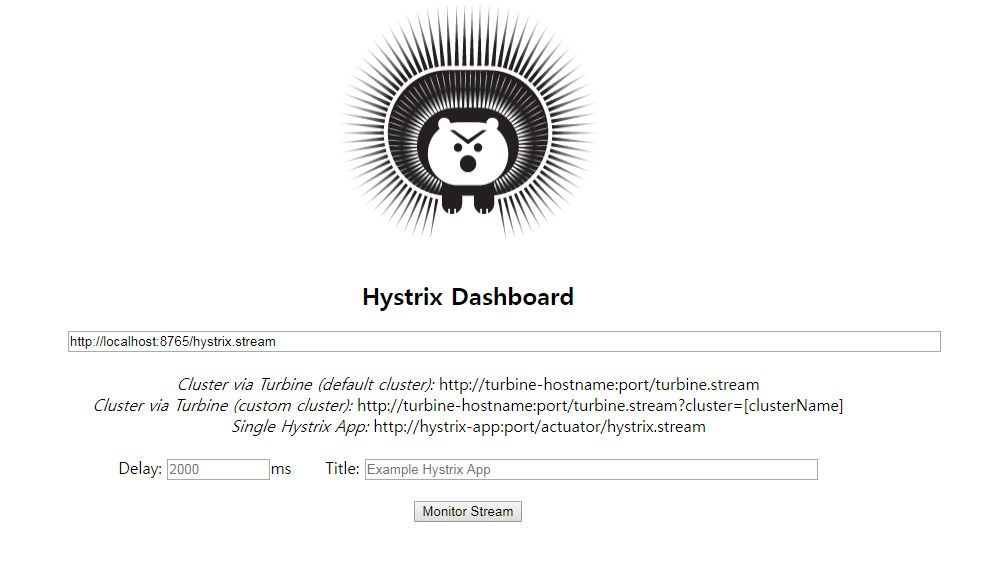
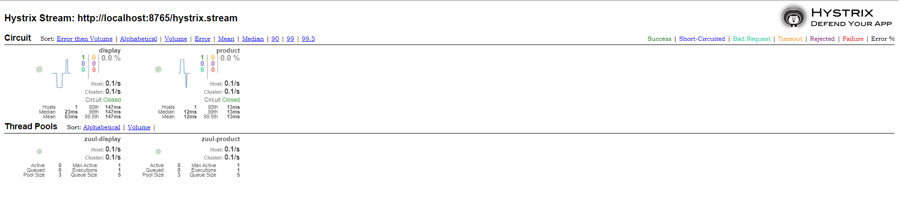
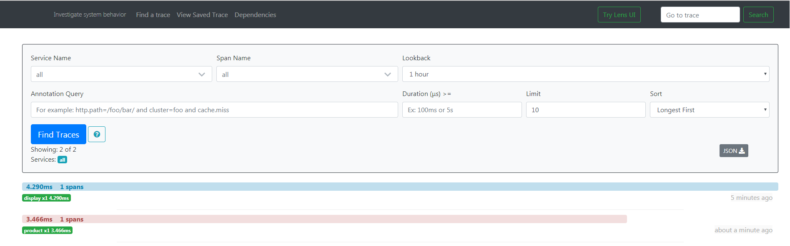
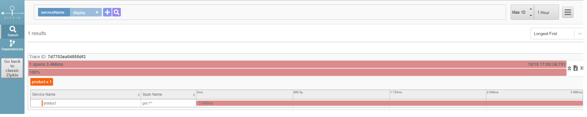
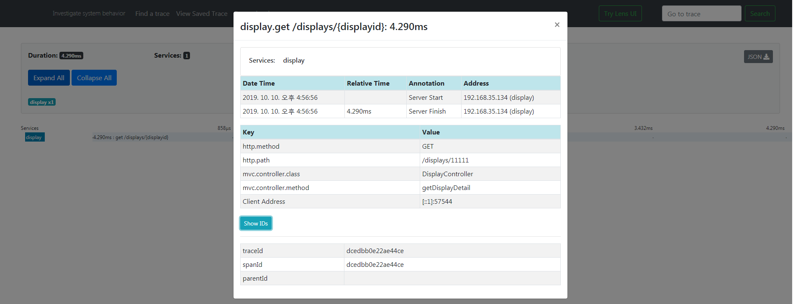

# spring-cloud-workshop
[](https://gitter.im/MSA_miniProject/community)&nbsp;
&nbsp;

MSA Development Project with Spring Boot

# Hystrix Dashboard
- Hystrix Dashboard는 앞의 Hystrix 설정에 따른 Circuit breaker의 상태를 모니터링 할 수 있는 dashboard를 제공해주는 라이브러리이다. 사실 라이브러리라기 보다는 솔루션에 가깝다고 할 정도로 간단한 설정으로 실행할 수 있다.

## Zuul의 build.gradle에 dependency 추가
```
compile('org.springframework.cloud:spring-cloud-starter-netflix-hystrix-dashboard')
compile('org.springframework.boot:spring-boot-starter-actuator')
```

## Zuul의 application.yml에 management 추가
```yaml
spring:
  application:
    name: zuul

server:
  port: 8765

management:
  security:
    enabled: false
  endpoints:
    web:
      exposure:
        include: hystrix.stream
      base-path: /
```

## ZuulApplication.java에 Annotation 추가
```java
@EnableZuulProxy
@EnableDiscoveryClient
@SpringBootApplication
@EnableHystrixDashboard
@EnableTurbine

public class ZuulApplication {

    public static void main(String[] args) {
        SpringApplication.run(ZuulApplication.class, args);
    }
}
```

## Hystrix Dashboard Connction
[Hystrix Dashboard]


[Hystrix Stream]



# Spring Sleuth를 이용한 Zipkin 연동
- application에서 Distributed Log Trace를 해보자.
Spring Boot application을 Zipkin과 연동하기 위해서는 Sleuth라는 Library를 사용하면 된다.

## MicroService의 build.gradle에 Zipkin 및 Sleuth dependency 추가
```
compile('org.springframework.cloud:spring-cloud-starter-zipkin')
compile('org.springframework.cloud:spring-cloud-starter-sleuth')
```

## MicroService의 application.yml에 zipkin 및 sample 추가
```yaml
spring:
  application:
    name: display

  zipkin:
    baseUrl: http://127.0.0.1:9411/
    sleuth:
      enabled: true
      sampler:
        probability: 1.0

  sample:
    zipkin:
      enabled: true
```

## MicroService의 Controller에 Annotation 추가
```java
public class DisplayController {
    @Autowired
    RestTemplate restTemplate;

    @Bean
    public RestTemplate getRestTemplate() {
        return new RestTemplate();
    }
```
- alwaysSampler() 정의를 통해 Tracing Transaction Rate를 결정 가능

## Zipkin 서버 구동
- jar 파일을 다운 받은 후에, java -jar로 서버를 구동하는게 간편하다.
※ 유의사항 : zipkin 서버를 통해서 HTTP로 Trace Log를 받을 때, 별도의 보안이나 인증 메커니즘이 없기 때문에 zipkin 서버는 반드시 방화벽 안에 놓고 서비스 서버로부터만 HTTP 호출을 받을 수 있도록 해야 한다.

```
> wget -O zipkin.jar   <-- Download
> java -jar zipkin.jar <-- Server 구동
```

## Zipkin을 통한 결과 확인
- 서비스 구동
- http://localhost:9411 Zipkin Server 접속
- Find Traces를 통한 개별 Transaction 확인

[Trace Result]





